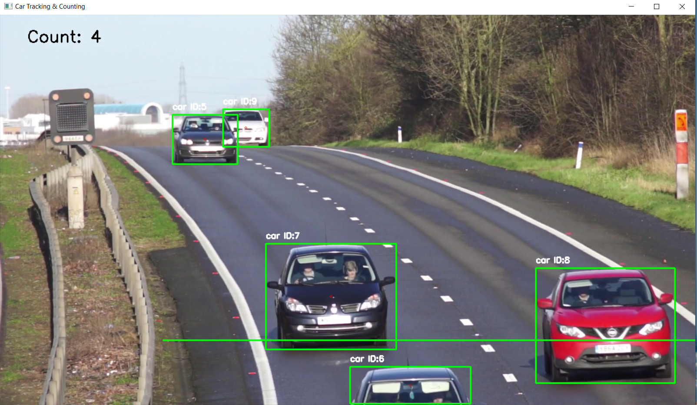

# 🚗 Real-Time Vehicle Detection and Counting System 🚦

Welcome to the **Real-Time Vehicle Detection and Counting System** project! This project is designed to track and count vehicles like cars, trucks, buses, and bikes from a video feed using the **YOLOv5s** object detection model. 🚀

---

## 📸 User View

Here’s how the system looks while running:  


---

## ✨ Features
- **Real-time Object Detection:** Utilizes the YOLOv5s model for detecting vehicles with high speed and accuracy.  
- **Customizable Classes:** Tracks specific vehicle classes (`car`, `truck`, `bus`, and `bike`).  
- **Counting Line Mechanism:** Counts vehicles crossing a predefined line on the screen.  
- **Object Tracking:** Maintains continuity of objects across frames using **Intersection over Union (IoU)**.  
- **Dynamic Management:** Removes objects not detected for a defined number of frames.  

---

## 📂 Project Structure

- ├── Data/ 
- │ └── Demo5.mp4 # Input video file 
- ├── userview.png # Screenshot of the user interface 
- ├── main.py # Main Python script 
- ├── requirements.txt # Install the required dependencies
- └── README.md # Project documentation

---
## 🔧 Installation & Setup

1. Clone this repository:
   ```bash
   git clone https://github.com/Akshay-K8/Real-Time-Vehicle-Detection-and-Counting-System.git
   ```
   ```
   cd vehicle-tracking
   ```
2. Install the required dependencies
   ```
   pip install -r requirements.txt
   ```
3. Place your input video file in the Data folder.

4. Run the project:
    ```
    python main.py
    ```
---
## 🛠️ How It Works

- Input Video: The system processes video frames from the file Data/Demo5.mp4.
- Object Detection: Vehicles are detected using YOLOv5s, and their bounding boxes are displayed.
- Tracking: Objects are tracked across frames using IoU for consistency.
- Counting Mechanism: A horizontal counting line is drawn, and vehicles crossing this line are counted.
- Output View: Real-time bounding boxes, class names, IDs, and a total vehicle count are displayed.
---
## 💡 Key Concepts Used

- YOLOv5 Model: Lightweight version for fast object detection.
- Intersection over Union (IoU): Metric for tracking objects across frames.
- OpenCV: For video processing and frame rendering.
---
